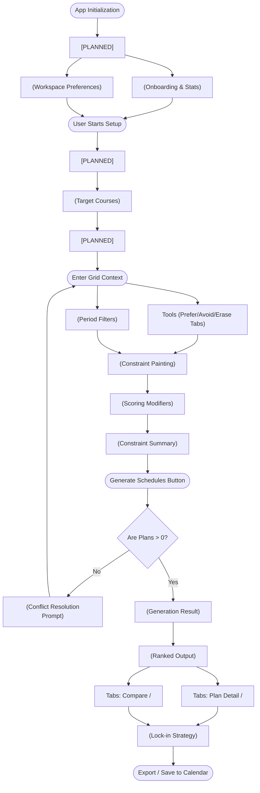

## UI Business Flow Map

## Phase 0: Global Configuration & Onboarding
*The entry point of the application where users land, orient themselves, and set universal rules that govern the entire planning workspace.*

- **Component:** `<Auth & Sync Flow> [PLANNED]`
  - **Business Purpose:** Authenticates the user with the university portal (e.g., HCMUS SSO) and syncs real-time course catalogs, prerequisite data, and historical grade data to personalize the planner.
  - **Current UX State & Refactor Plan:** (Conceptual) Needs a seamless OAuth or credential integration before reaching the Dashboard.

- **Component:** `<DashboardView />`
  - **Business Purpose:** Serves as the onboarding hub and statistical overview of the user's current planner state. It bridges the gap for new users to understand the "Constraint-first" methodology.
  - **Current UX State & Refactor Plan:** Currently isolated correctly from the main Builder. Ensure its cards align with the new minimalist, borderless design system.

- **Component:** `<SettingsView />` (Workspace Preferences)
  - **Business Purpose:** Handles global application rules (e.g., theme, default campus locations, strict vs. relaxed solver modes) that don't belong in the per-plan Builder UI.
  - **Current UX State & Refactor Plan:** Secondary administrative feature. Keep it out of the main flow, accessible only via the side navigation.

## Phase 1: Input / Setup
*The initial stage where users define their hard requirements (what they must take) before engaging with time constraints.*

- **Component:** `<CourseSearchModal /> [PLANNED]`
  - **Business Purpose:** A robust search interface allowing users to query the synced university database by course code, name, or department. Previews credits, prerequisites, and available sections.
  - **Current UX State & Refactor Plan:** (Conceptual) Will replace the current static "Add Course" button with a dynamic, typeahead-enabled modal overlay.

- **Component:** `<CourseCard />`
  - **Business Purpose:** Displays selected courses and credit hours to ensure the user has the right academic payload before generating schedules.
  - **Current UX State & Refactor Plan:** Core functionality, but visually boxed. Needs to be de-boxed and streamlined for a minimalist aesthetic to reduce visual clutter.

- **Component:** `<SectionPinToggle /> [PLANNED]`
  - **Business Purpose:** Allows users to bypass algorithmic time constraints for specific classes by permanently locking in a specific section ID or professor. This acts as a hard requirement during the OLS generation.
  - **Current UX State & Refactor Plan:** (Conceptual) Should be integrated directly into the expanded state of a `<CourseCard />` as a small, unobtrusive lock icon or dropdown list.

## Phase 2: Core Constraint Mapping
*The central workspace where users define their availability and time preferences using the interactive grid.*

- **Component:** `Tool Tabs (Prefer/Avoid/Erase)` & `Quick Presets`
  - **Business Purpose:** Defines the active painting tool state for interacting with the grid.
  - **Current UX State & Refactor Plan:** Core interaction layer. Should be integrated into a sleek, floating toolbar rather than consuming permanent card space.

- **Component:** `<LabToggle />`
  - **Business Purpose:** Toggles half-periods (e.g., 2.5, 8.5) to keep the grid clean for students not taking lab classes.
  - **Current UX State & Refactor Plan:** Secondary feature. Needs to be condensed into a minimal settings dropdown or icon toggle to save horizontal space.

- **Component:** `Top Status Cards` (Core app state, Active tool, Selection preview)
  - **Business Purpose:** Provides real-time feedback on grid interactions and total constraints applied.
  - **Current UX State & Refactor Plan:** Highly bloated. These permanently consume valuable vertical canvas space. Refactor into lightweight, inline tooltip feedback or merge into a single minimal status bar.

- **Component:** `<WeeklyPeriodGrid />`
  - **Business Purpose:** The primary interactive canvas where the mathematical OLS constraints (Avoid/Prefer arrays) are visually painted by the user.
  - **Current UX State & Refactor Plan:** Core focus. Keep prominent, but remove surrounding card borders to let it breathe naturally within the main viewport.

- **Component:** `Bottom Status Cards` (Prefer slots, Avoid slots, Multi-select, Erase mode)
  - **Business Purpose:** Explains interaction mechanics and aggregates rule counts.
  - **Current UX State & Refactor Plan:** Redundant UX bloat. Instructional text should be moved to a one-time onboarding flow or tooltip. Aggregate counts should move to the `RightRail`.

## Phase 3: Modifiers & Execution
*The final tweaking stage before handing the constraint state over to the math engine.*

- **Component:** `<BuilderPreferenceCard />`
  - **Business Purpose:** Handles boolean secondary scoring modifiers (Fewer study days, Close-gap classes, Friend matching) that affect the OLS ranking algorithm without strictly blocking plans.
  - **Current UX State & Refactor Plan:** Secondary feature. Takes up too much permanent input column space. Should be collapsed under an "Advanced Scoring" accordion or modal.

- **Component:** `<RightRail />` (Constraint Summary & Generate Button)
  - **Business Purpose:** The single source of truth aggregating all constraints, serving as the final confirmation panel and housing the primary "Generate" call-to-action.
  - **Current UX State & Refactor Plan:** Core functionality. The recent layout fix placed this perfectly in the 3rd column. Maintain its sticky visibility but de-box the individual summary chips to fit the minimalist theme.

## Edge Case: Zero-Result Fallback
*The handling mechanism when the math engine determines the user's constraints and course requirements are physically impossible to satisfy.*

- **Component:** `<EmptyState />` & Conflict Prompt
  - **Business Purpose:** Intercepts a 0-plan generation result and guides the user to loosen specific constraints (e.g., "You requested no Friday classes, but course X only runs on Fridays").
  - **Current UX State & Refactor Plan:** Needs to be explicitly designed as a supportive error state, returning the user to the `BuilderView` with highlighted conflict areas rather than just showing a blank screen.

## Phase 4: Review & Decision
*The output stage where generated plans are ranked, compared, and finalized.*

- **Component:** `<StatusBanner />`
  - **Business Purpose:** Alerts the user to the success or failure of the generation engine (e.g., "Generated 12 plans").
  - **Current UX State & Refactor Plan:** Necessary feedback, but should ideally be a transient toast notification rather than a permanent DOM element shifting the layout.

- **Component:** `<PlanList />`
  - **Business Purpose:** Displays the ranked output from the algorithm, allowing selection for deep-dive review or side-by-side comparison.
  - **Current UX State & Refactor Plan:** Core. Needs to maintain its scannability while adopting borderless list items.

- **Component:** `<ScoreBar />` (inside Plan Detail)
  - **Business Purpose:** Visually explains the OLS regression breakdown (Constraint fit, Gap efficiency, etc.) to build trust in the algorithm's ranking.
  - **Current UX State & Refactor Plan:** Excellent context, keep prominent but refine the progress bar visuals for a sleeker look.

- **Component:** `<PlanComparisonTable />`
  - **Business Purpose:** Side-by-side matrix view allowing users to weigh tradeoffs between Primary (Plan A) and Backup (Plan B/C) strategies.
  - **Current UX State & Refactor Plan:** Core decision tool. Currently housed inside a Tab system; ensure it uses maximum horizontal space when active.

## Phase 5: Post-Decision & Export
*The final lock-in phase where the user finalizes their academic strategy and exports it to external systems.*

- **Component:** `<DecisionSummary />`
  - **Business Purpose:** Displays the officially selected Primary (Plan A) and confirmed Backup (Plan B/C), finalizing the decision loop.
  - **Current UX State & Refactor Plan:** Currently somewhat implicit in the `PlansView`. Needs to be elevated to a clear "Confirm Selection" modal or sticky action bar.

- **Component:** `Export Actions` (Save/Calendar integration)
  - **Business Purpose:** Allows the user to take their confirmed schedule out of the app (e.g., downloading an ICS file or syncing to Google Calendar).
  - **Current UX State & Refactor Plan:** Missing or buried. Should be the final glowing CTA once a plan is locked in.